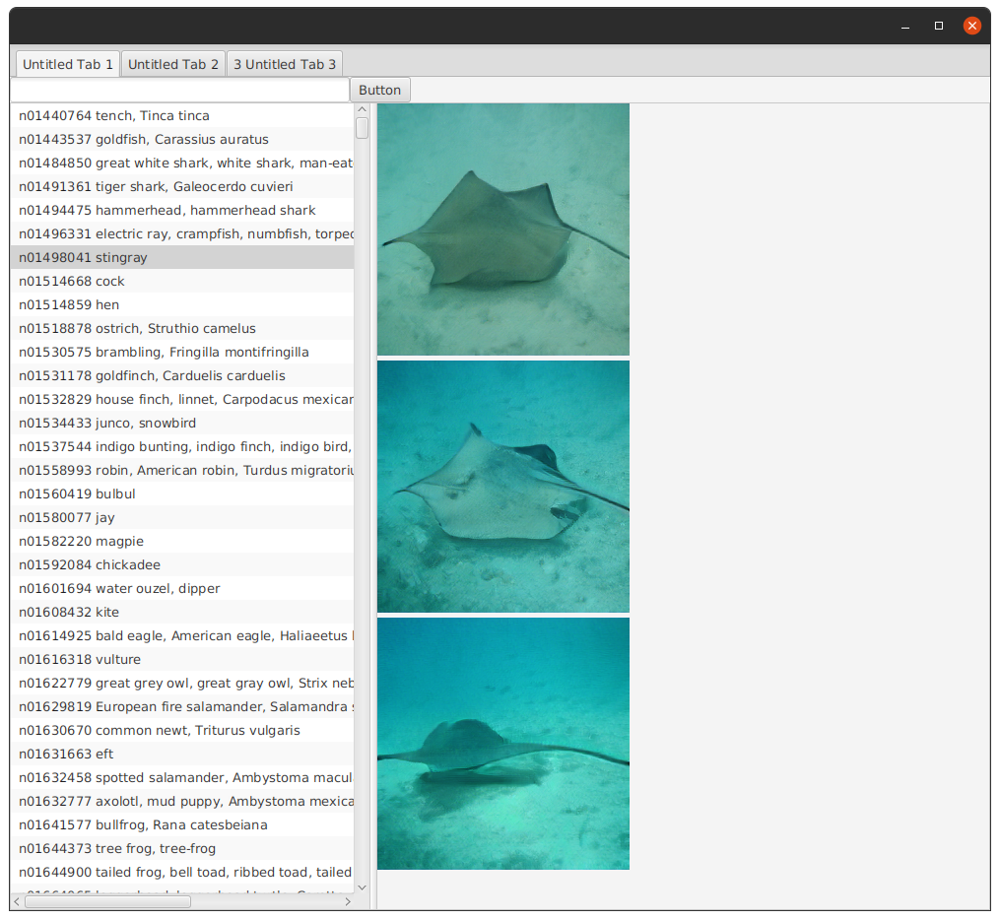

            <h3>Overview</h3>
            
            
		
                <helper:RandomGreeting /> &nbsp;
                Big GAN (generative adversarial network) is a type of  neural network
                capable of generating images.
           

        

        

        

            <h3>Dataset</h3>
            
            
		
                 &nbsp;
                How are is the int [] mapped to the type of corresponding category/image?
            

            
            

                
                <a href="https://github.com/deepjavalibrary/djl/blob/master/model-zoo/src/test/resources/mlrepo/model/cv/image_classification/ai/djl/zoo/synset_imagenet.txt" >
                        They are mapped by this file.
                        </a>
            

           

        

        
        

            <h3>About the Appliction</h3>
            
            
		
                 &nbsp;
                The application is pretty much a GUI wrapper for the 'BigGAN' example 
                in the 
                <a href='https://github.com/deepjavalibrary/djl/'>
                deepjavalibrry/djl repository
                </a>.
            

            
            

                The actual borrowed code is in this Java file:
                
                 
                 
                
                <b>
                    https://github.com/deepjavalibrary/djl/blob/master/examples/src/main/java/ai/djl/examples/inference/BigGAN.java
                </b>
            

            

                Here is a screenshot of the application.
            

            
            
            
            

                Displayed on the left side of the split pane is a list of the category names
                available for image generation.  Clicking on a category name disables the list,
                while 3 images are generated.
            

            
            

                While the images are generated, the UI is disabled.  When the image generation 
                completes, the images are displayed on the right side of the split
                pane.
            

            
            

                The category names are searchable via the text field and button above the 
                list.
            

        

        
                

            <h3>Going Further</h3>
            
            
		
                 &nbsp;
                
                 
            

            
            <pre>
Add a tabbed interface
    Dropdown
    
    thumbnail matrix             
            </pre>

        
   
        
            <h3>Resources</h3>
            
            
		
                 &nbsp;
            

            
            <ul>
                <li>
                    <a href="http://djl.ai/examples/docs/biggan.html" >
                        DJL Examples Documentation
                    </a>
                </li>
                
                <li>
                    <a href="https://machinelearningmastery.com/a-gentle-introduction-to-the-biggan/" >
                        A Gentle Introduction to the Big GAN
                        </a>
                </li>

                
                                
                <li>
                    
                </li>
            </ul>
        

